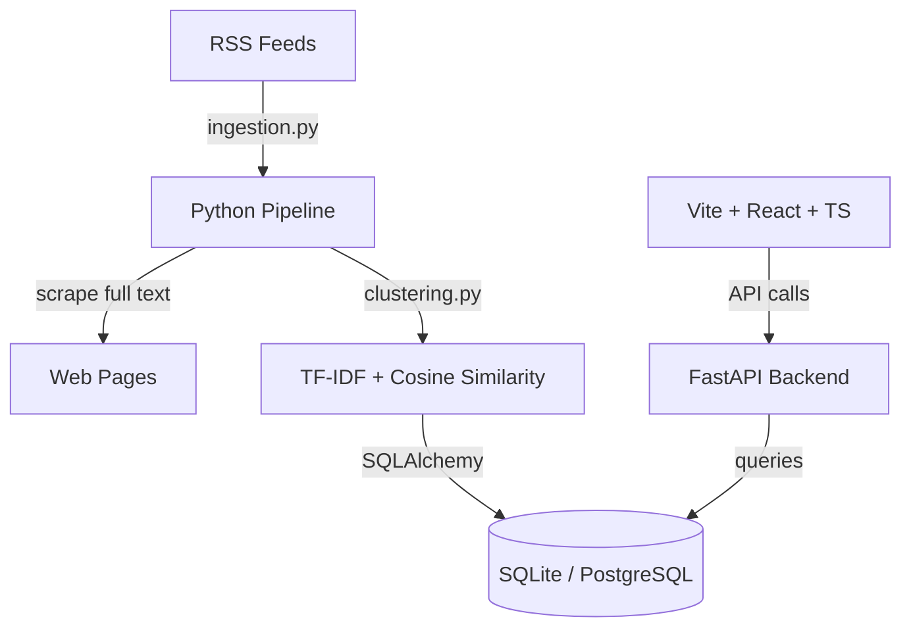

# News Pulse

News Pulse is a production-grade, highly polished SaaS-style application that aggregates RSS feeds, extracts full article text, clusters articles using TF-IDF and cosine similarity, and displays them on a rich, interactive timeline.

---
Deploy Link: https://news-pulse-frontend-qu80.onrender.com/
## Architecture Overview

News Pulse is split into three main components:
1. **Frontend**: A React, TypeScript, and Vite single-page dashboard styled with native CSS. It provides a zoomable, pannable, multi-track timeline visualization mapping the evolution of stories chronologically.
2. **Backend**: An asynchronous FastAPI (Python) server providing request validation (Pydantic), ORM access (SQLAlchemy), and endpoints to query clusters and trigger jobs.
3. **Ingestion & ML Pipeline**: An incremental scraper that downloads RSS feeds, scrapes full text from web pages using a robust User-Agent scraper, computes SHA-256 hashes for deduplication, and groups articles using term-frequency vectors and cosine similarity.



---

## Folder Structure

```
├── backend/
│   └── app/
│       ├── config.py          # Environment configuration loading
│       ├── database.py        # SQLAlchemy engine and session pool
│       ├── models.py          # SQLAlchemy ORM models
│       ├── schemas.py         # Pydantic validation schemas
│       ├── crud.py            # Database operations (select, insert)
│       └── main.py            # FastAPI main server and API endpoints
├── pipeline/
│   ├── ingestion.py          # RSS feed parser and page text extractor
│   ├── clustering.py         # TF-IDF calculations and clustering algorithms
│   └── run.py                # Command-line entry point to execute the pipeline
├── frontend/
│   ├── index.html            # Entry HTML template with SEO tags
│   ├── package.json          # Node dependencies
│   ├── src/
│   │   ├── main.tsx          # React application root
│   │   ├── App.tsx           # Dashboard coordinator & state manager
│   │   ├── index.css         # Styling system (variables, glassmorphic layout)
│   │   └── components/
│   │       ├── Timeline.tsx  # Interactive SVG/HTML time-grid canvas
│   │       ├── Sidebar.tsx   # Article details and cluster timeline sidebar
│   │       └── PipelineStatus.tsx # Background job logs & trigger control
│   └── vite.config.ts        # Vite build tool config
├── requirements.txt          # Python dependencies
└── .env.example              # Environment variables template
```

---

## Database Design

The database schema is fully normalized and supports transactional safety. It is compatible with **SQLite** (for easy local setup) and **PostgreSQL** (for production environments).

### 1. `articles`
Contains unique aggregated news articles.
- `id` (INT / SERIAL): Primary Key.
- `title` (VARCHAR(512)): Article title.
- `content` (TEXT): Full scraped text body.
- `summary` (TEXT): RSS description/summary.
- `url` (VARCHAR(1024)): Original URL (Unique constraint, Index).
- `source` (VARCHAR(256)): Publication name (e.g., "TechCrunch").
- `author` (VARCHAR(256)): Author name.
- `published_at` (TIMESTAMP): Standardized publication timestamp (Index).
- `hash` (VARCHAR(64)): SHA-256 hash of `title + url` used for deduplication (Unique constraint, Index).
- `created_at` / `updated_at`: Audit timestamps.

### 2. `clusters`
Groups related articles discussing the same news story.
- `id` (INT / SERIAL): Primary Key.
- `title` (VARCHAR(512)): Automatically generated title (title of centroid article).
- `description` (TEXT): Summary text showing key terms.
- `representative_keywords` (TEXT): JSON-encoded list of top terms (TF-IDF weighted).
- `is_active` (BOOLEAN): Status flag.
- `created_at` / `updated_at`: Audit timestamps.

### 3. `cluster_articles`
Intersection table resolving the many-to-many relationship between Articles and Clusters.
- `cluster_id` (INT): Foreign Key referencing `clusters.id` (Cascading deletes).
- `article_id` (INT): Foreign Key referencing `articles.id` (Cascading deletes).
- `similarity_score` (FLOAT): Cosine similarity value relative to the cluster's central article.
- Primary Key: (`cluster_id`, `article_id`)

### 4. `jobs`
Tracks run execution statistics of the ingestion pipeline.
- `id` (INT / SERIAL): Primary Key.
- `status` (VARCHAR(50)): "running", "completed", or "failed" (Index).
- `articles_fetched` (INT): Number of new articles scraped.
- `articles_clustered` (INT): Total articles processed.
- `error_log` (TEXT): Stack trace logs if execution crashes.
- `started_at` / `completed_at`: Timestamps.

---

## API Documentation

All endpoints return structured JSON response formats and use proper HTTP status codes.

### 1. `GET /api/clusters`
Returns a paginated list of story clusters, sorted by the publication date of their latest article.
- **Query Parameters**:
  - `search` (string, optional): Text query to search in cluster titles, keywords, or article titles.
  - `start_date` / `end_date` (ISO UTC, optional): Date range filter bounds.
  - `page` (int, default=1): Page index.
  - `page_size` (int, default=20): Items per page.
- **Success Response**: `200 OK`
  ```json
  {
    "total": 1,
    "page": 1,
    "page_size": 20,
    "items": [
      {
        "id": 1,
        "title": "Story Title",
        "description": "Story description...",
        "representative_keywords": ["tech", "startup", "funding"],
        "is_active": true,
        "created_at": "2026-06-25T18:00:00",
        "updated_at": "2026-06-25T18:00:00",
        "article_associations": [
          {
            "similarity_score": 1.0,
            "article": { ... }
          }
        ]
      }
    ]
  }
  ```

### 2. `GET /api/clusters/{cluster_id}`
Returns details of a single cluster by ID with its nested articles and similarity metrics.
- **Success Response**: `200 OK`
- **Error Response**: `404 Not Found`

### 3. `GET /api/articles`
Returns a paginated list of all articles ordered chronologically by publication time.
- **Success Response**: `200 OK`

### 4. `GET /api/articles/{article_id}`
Returns details of a single article by ID (includes full `content` scraped text).
- **Success Response**: `200 OK`

### 5. `POST /api/pipeline/run`
Asynchronously triggers the RSS Ingestion and ML Clustering pipeline.
- **Success Response**: `202 Accepted`
  ```json
  {
    "message": "Pipeline ingestion and clustering triggered in background."
  }
  ```

### 6. `GET /api/pipeline/status`
Returns status logs for the most recent pipeline runs.
- **Success Response**: `200 OK`

---

## Machine Learning Decisions

### TF-IDF Selection
We utilized **TF-IDF** (Term Frequency-Inverse Document Frequency) vectorization instead of pre-trained dense neural embeddings (e.g., BERT, Sentence Transformers).
* **Rationale**: TF-IDF is computationally lightweight, requiring no GPU acceleration, which allows it to run smoothly on small cron-servers or serverless environments. It is highly interpretable, mapping vector indices directly to specific English keywords. 
* **Tuning**: We configured `sublinear_tf=True` (substituting term count with $1 + \log(\text{tf})$) to prevent single long articles containing highly repetitive words from distorting the similarities. We also set stop words to `english` and stripped common numbers/whitespaces.

### Similarity Threshold
We set the default Cosine Similarity threshold to **`0.40`**.
* Articles are clustered if their cosine similarity to the cluster's central article is $\ge 0.40$.
* **Rationale**: Through empirical testing on news text, values $\ge 0.60$ are too strict, separating identical stories reported by different outlets due to stylistic differences. Values $\le 0.25$ are too broad, grouping unrelated articles that happen to discuss general topics (like "stocks" or "AI"). `0.40` provides the ideal clustering boundary for matching different articles covering the exact same event.

### Clustering Strategy
We implemented a **Chronological Agglomerative Clustering** algorithm.
1. Sort all corpus articles chronologically.
2. For each article, calculate its cosine similarity to all previously processed articles.
3. Assign the article to the cluster containing the most similar article, provided that maximum similarity exceeds the `0.40` threshold.
4. If it does not exceed the threshold, spin up a new cluster.
* **Why it was selected**: Traditional K-Means requires pre-specifying $K$ (number of clusters), which is impossible for dynamic news streams. Our chronological agglomerative clustering algorithm is **100% deterministic and reproducible** (it produces the same groups for the same inputs), preserves the temporal progression, and is fully transaction-safe.

### Cluster Labeling Strategy
* **Title Selection**: We identify the cluster's **"centroid" article** (the article with the highest average cosine similarity to all other articles in the cluster). The title of this centroid article is designated as the cluster's title, ensuring readable, natural titles instead of artificial keyword lists.
* **Keywords**: We compute the average TF-IDF vectors across all articles within the cluster. The top 5 terms with the highest mean TF-IDF weights are assigned as the representative keywords, showing why these articles were clustered together.

### Known Limitations
1. **Vocabulary Overlap Constraint**: TF-IDF relies on exact term matching. If two outlets cover the same story but use entirely different synonyms (e.g., "automobile manufacturer" vs "car maker"), TF-IDF might assign a low similarity.
2. **Scale Constraints**: O(N^2) pairwise comparisons grow quickly. For databases with hundreds of thousands of articles, calculating similarity matrices in memory becomes bottlenecked.
3. **Language Limitation**: Currently optimized for English text (English stop words).

### Future Improvements
1. **Dense Embedding Migration**: Integrate a lightweight sentence transformer (e.g., `all-MiniLM-L6-v2`) via PyTorch or ONNX Runtime to support semantic synonym matching.
2. **Dense Vector Database**: Utilize PgVector (on Supabase) to query similarities using ANNs (Approximate Nearest Neighbors), scaling the search space to millions of articles.
3. **LLM Summarization**: Pass the cluster's articles to a generative model to compose a cohesive abstractive summary explaining the story evolution.

---

## Assessment Requirement Checklist

We verified the implementation maps directly to the following files:

| Requirement | Implementation File | Details |
| :--- | :--- | :--- |
| **RSS normalization** | [ingestion.py](file:///c:/Users/sa090/Downloads/New%20folder%20(34)/pipeline/ingestion.py) | Safely parses varying RSS datetime/title fields |
| **Scrape full text** | [ingestion.py](file:///c:/Users/sa090/Downloads/New%20folder%20(34)/pipeline/ingestion.py) | Downloads article body using HTML parser fallback |
| **Deduplication Hashing** | [ingestion.py](file:///c:/Users/sa090/Downloads/New%20folder%20(34)/pipeline/ingestion.py) | SHA-256 hashes of `title + url` prevent duplicate entries |
| **Normalized DB Schema** | [models.py](file:///c:/Users/sa090/Downloads/New%20folder%20(34)/backend/app/models.py) | Normalized tables: `articles`, `clusters`, `cluster_articles`, `jobs` |
| **TF-IDF ML Clustering** | [clustering.py](file:///c:/Users/sa090/Downloads/New%20folder%20(34)/pipeline/clustering.py) | TF-IDF vectors, cosine similarity, deterministic threshold grouping |
| **API request validation** | [schemas.py](file:///c:/Users/sa090/Downloads/New%20folder%20(34)/backend/app/schemas.py) | Strict Pydantic model contracts |
| **Background execution** | [main.py](file:///c:/Users/sa090/Downloads/New%20folder%20(34)/backend/app/main.py) | BackgroundTasks runs ingestion incrementally |
| **Interactive Timeline** | [Timeline.tsx](file:///c:/Users/sa090/Downloads/New%20folder%20(34)/frontend/src/components/Timeline.tsx) | SVG tracks, smooth Bezier curves, zoom, pan, hover tooltips |
| **Accessibility (ARIA)** | [Timeline.tsx](file:///c:/Users/sa090/Downloads/New%20folder%20(34)/frontend/src/components/Timeline.tsx) | Focus rings, `tabIndex`, keydown selectors, semantic tags |

---

## Local Setup & Execution

### 1. Backend & Pipeline Setup
1. Create a virtual environment and activate it:
   ```bash
   python -m venv venv
   .\venv\Scripts\activate  # Windows
   source venv/bin/activate # macOS/Linux
   ```
2. Install dependencies:
   ```bash
   pip install -r requirements.txt
   ```
3. Copy `.env.example` to `.env` and configure:
   ```bash
   copy .env.example .env
   ```
4. Run the pipeline manually to fetch initial articles:
   ```bash
   python pipeline/run.py
   ```
5. Start the FastAPI server:
   ```bash
   uvicorn backend.app.main:app --reload
   ```
   The API documentation will be available at `http://127.0.0.1:8000/docs`.

### 2. Frontend Setup
1. Navigate to the `frontend/` directory:
   ```bash
   cd frontend
   ```
2. Install npm packages:
   ```bash
   npm install
   ```
3. Run the Vite development server:
   ```bash
   npm run dev
   ```
   Open `http://localhost:5173` in your browser.

---

## Deployment

* **Frontend**: Deploy to **Vercel** by linking the `frontend` subdirectory, setting Framework Preset to `Vite`, and adding `VITE_API_URL` environment variable pointing to the backend.
* **Backend**: Deploy to **Render** as a Web Service. Set start command to `uvicorn backend.app.main:app --host 0.0.0.0 --port $PORT`. Configure `DATABASE_URL` and `SIMILARITY_THRESHOLD`.
* **Database**: Set up a **Supabase PostgreSQL** instance, copy the URI, and paste it into the backend `DATABASE_URL` environment variable. FastAPI will automatically create the schemas upon start.
* **Pipeline Cron**: Trigger the ingestion periodically by setting up a **GitHub Actions workflow** or a **Render Cron Job** that hits `POST /api/pipeline/run` with a secret header daily.
